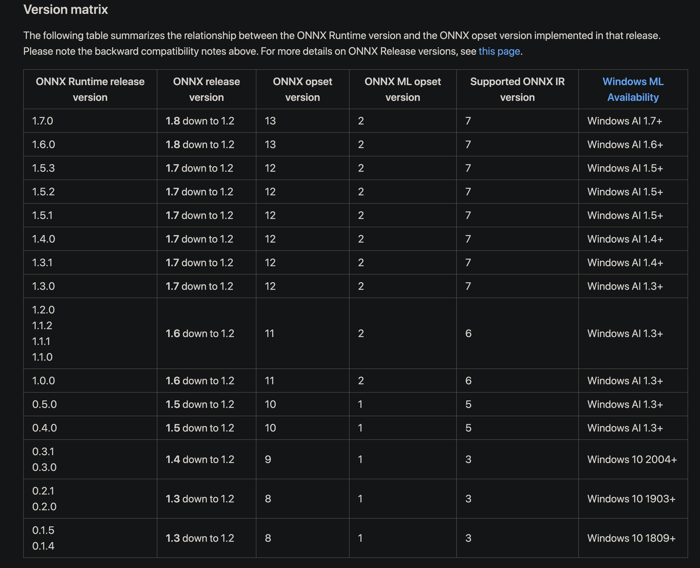
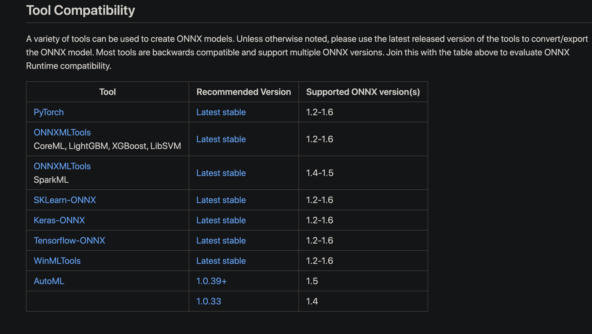

## 🔥🔥🔥 全网最详细 ONNXRuntime C++/Java/Python 使用教程 ！  

  

整理不易，持续更新，如果对你有用的话，❤️那就给个⭐️🌟支持一下吧~ 🙃🤪🍀  

## 前言  
这份文档主要记录了onnxruntime的一些参考资料，包含C++/Java/Python，以及本人在使用过程中的一些经验。

## 1. onnxruntime官方资料
* [1] [onnxruntime官网学习资料](https://www.onnxruntime.ai/)
* [2] [onnxruntime自定义op](https://www.onnxruntime.ai/docs/how-to/export-pytorch-model.html)
* [3] [onnxruntime-gpu和cuda版本对应](https://github.com/microsoft/onnxruntime/releases/tag/v1.5.1)
* [4] [onnxruntime-openmp](https://pypi.org/project/onnxruntime-openmp/)
* [5] [onnxruntime和cuda之间的版本对应-很详细](https://www.onnxruntime.ai/docs/reference/execution-providers/CUDA-ExecutionProvider.html#version-dependency)
* [6] [onnxruntime-api文档](https://www.onnxruntime.ai/docs/get-started/inference.html)
* [7] [onnxruntime-python-api-docs](https://www.onnxruntime.ai/python/api_summary.html#)
* [8] [onnxruntime-java-api-docs](https://www.onnxruntime.ai/java/)

## 2.onnxruntime-C++参考
* [1] [onnx_runtime_cpp-github](https://github.com/xmba15/onnx_runtime_cpp)
* [2] [onnxruntime python/c/c++/java使用案列](https://www.onnxruntime.ai/docs/get-started/inference.html)
* [3] [onnxruntime-各种语言官方案列](https://github.com/microsoft/onnxruntime/tree/master/samples)
* [4] [onnxruntime的c++使用](https://blog.csdn.net/baidu_34595620/article/details/112176278)
* [5] [onnxruntime-cxx官方案例](https://github.com/microsoft/onnxruntime/blob/master/csharp/test/Microsoft.ML.OnnxRuntime.EndToEndTests.Capi/CXX_Api_Sample.cpp)
* [6] [onnxruntime-FAQ](https://github.com/microsoft/onnxruntime/blob/master/docs/FAQ.md)
* [7] [onnxruntime-c++多输入多数出case](https://github.com/microsoft/onnxruntime/blob/master/onnxruntime/test/shared_lib/test_inference.cc)

## 3. onnxruntime-java参考
* [1] [onnxruntime-minst-java](https://github.com/microsoft/onnxruntime/blob/master/java/src/test/java/sample/ScoreMNIST.java)
* [2] [在java中使用onnxruntime](https://blog.csdn.net/mzl87/article/details/109170580)
* [3] [onnxruntime的build.gradle](https://github.com/microsoft/onnxruntime/blob/master/java/build.gradle)

## 4. onnxruntime的Docker镜像
* [1] [Dockerfile-onnxruntime](https://github.com/microsoft/onnxruntime/tree/master/dockerfiles)

## 5. onnxruntime源码编译
* [1] [onnxruntime源码编译](https://blog.csdn.net/wuqingshan2010/article/details/106372580#t1)
* [2] [linux编译onnxruntime](https://blog.csdn.net/hxljzx/article/details/111320847?utm_medium=distribute.pc_relevant.none-task-blog-baidujs_baidulandingword-1&spm=1001.2101.3001.4242)
* [3] [onnxruntime编译选项解析](https://blog.csdn.net/zhuikefeng/article/details/108672033?utm_medium=distribute.pc_relevant.none-task-blog-2%7Edefault%7EBlogCommendFromBaidu%7Edefault-6.control&dist_request_id=1330144.24052.16181386077064005&depth_1-utm_source=distribute.pc_relevant.none-task-blog-2%7Edefault%7EBlogCommendFromBaidu%7Edefault-6.control)
* [4] [onnxtunrime中CMake使用指南和ABI-Dev-Notes](https://blog.csdn.net/xxradon/article/details/104100442/)
* [5] [onnxruntime-cmake_guildline.md](https://github.com/microsoft/onnxruntime/blob/master/docs/cmake_guideline.md)
* [6] [mac编译中出现has no symbols提示](https://www.cnblogs.com/zzugyl/p/4193647.html)

## 6. 开源项目
* [1] [chineseocr_lite-onnxruntime/ncnn等各种语言应用](https://github.com/DayBreak-u/chineseocr_lite)
* [2] [onnxruntime-projects](https://codechina.csdn.net/mirrors/tenglike1997/onnxruntime-projects)
* [3] [比较不错的Ort-c++应用项目](https://github.com/xmba15/onnx_runtime_cpp)


## 7. 与ONNX的Opset兼容性
* [1] [onnxruntime与onnx各opset的对应](https://github.com/microsoft/onnxruntime/blob/master/docs/Versioning.md)



与各个转换工具的兼容性


## 8. 获取Ort::Value的值
### 8.1 通过At<>获取
```c++
TEST(CApiTest, access_tensor_data_elements) {
  /**
   * Create a 2x3 data blob that looks like:
   *
   *  0 1 2
   *  3 4 5
   */
  std::vector<int64_t> shape = {2, 3};
  int element_count = 6;  // 2*3
  std::vector<float> values(element_count);
  for (int i = 0; i < element_count; i++)
    values[i] = static_cast<float>(i);

  Ort::MemoryInfo info("Cpu", OrtDeviceAllocator, 0, OrtMemTypeDefault);

  Ort::Value tensor = Ort::Value::CreateTensor<float>(info, values.data(), values.size(), shape.data(), shape.size());

  float expected_value = 0;
  for (int64_t row = 0; row < shape[0]; row++) {
    for (int64_t col = 0; col < shape[1]; col++) {
      ASSERT_EQ(expected_value++, tensor.At<float>({row, col}));
    }
  }
}
```
### 8.2 通过裸指针获取
```c++
  const float *var_angles = output_var_tensors.front().GetTensorMutableData<float>();
  const float *conv_angles = output_conv_tensors.front().GetTensorMutableData<float>();
  const float mean_yaw = (var_angles[0] + conv_angles[0]) / 2.0f;
  const float mean_pitch = (var_angles[1] + conv_angles[1]) / 2.0f;
  const float mean_roll = (var_angles[2] + conv_angles[2]) / 2.0f;
```
### 8.3 通过引用&和At获取
Ort::Value不允许复制拷贝，因此无法通过`=`去使用输出的结果，但是可以结合引用`&+At<>`来获取，使用方式如下:
```c++
  ort::Value &var_angles_tensor = output_var_tensors.at(0);
  ort::Value &conv_angles_tensor = output_conv_tensors.at(0);
  const float mean_ref_yaw = 
      (var_angles_tensor.At<float>({0}) + conv_angles_tensor.At<float>({0})) / 2.0f;
  const float mean_ref_pitch = 
      (var_angles_tensor.At<float>({1}) + conv_angles_tensor.At<float>({1})) / 2.0f;
  const float mean_ref_roll =
      (var_angles_tensor.At<float>({2}) + conv_angles_tensor.At<float>({2})) / 2.0f;
```
可以看到`At<>`的源码为：
```c++
inline T& Value::At(const std::vector<int64_t>& location) {
  static_assert(!std::is_same<T, std::string>::value, "this api does not support std::string");
  T* out;
  ThrowOnError(GetApi().TensorAt(p_, location.data(), location.size(), (void**)&out));
  return *out;
}
```
实际上也是利用指针`p_`获取数据，只不过`At`替我们处理了数据位置的计算。这个方法返回的实际上是一个`非const`引用，这意味着你可以通过这个引用直接修改内存中的值。
### 8.4 其他用法参考
```c++
std::vector<OrtSessionHandler::DataOutputType> OrtSessionHandler::OrtSessionHandlerIml::
operator()(const std::vector<float*>& inputData)
{
    if (m_numInputs != inputData.size()) {
        throw std::runtime_error("Mismatch size of input data\n");
    }

    Ort::MemoryInfo memoryInfo = Ort::MemoryInfo::CreateCpu(OrtArenaAllocator, OrtMemTypeDefault);

    std::vector<Ort::Value> inputTensors;
    inputTensors.reserve(m_numInputs);

    for (int i = 0; i < m_numInputs; ++i) {
        inputTensors.emplace_back(std::move(
            Ort::Value::CreateTensor<float>(memoryInfo, const_cast<float*>(inputData[i]), m_inputTensorSizes[i],
                                            m_inputShapes[i].data(), m_inputShapes[i].size())));
    }

    auto outputTensors = m_session.Run(Ort::RunOptions{nullptr}, m_inputNodeNames.data(), inputTensors.data(),
                                       m_numInputs, m_outputNodeNames.data(), m_numOutputs);

    assert(outputTensors.size() == m_numOutputs);
    std::vector<DataOutputType> outputData;
    outputData.reserve(m_numOutputs);

    int count = 1;
    for (auto& elem : outputTensors) {
        DEBUG_LOG("type of input %d: %s", count++, toString(elem.GetTensorTypeAndShapeInfo().GetElementType()).c_str());
        outputData.emplace_back(
            std::make_pair(std::move(elem.GetTensorMutableData<float>()), elem.GetTensorTypeAndShapeInfo().GetShape()));
    }

    return outputData;
}
```

## 9. 源码应用案例
* [1] [onnxruntime-c++多输入多输出案列](https://blog.csdn.net/baidu_34595620/article/details/112176278)
```c++
#include <assert.h>
#include <vector>
#include <onnxruntime_cxx_api.h>

int main(int argc, char* argv[]) {
  Ort::Env env(ORT_LOGGING_LEVEL_WARNING, "test");
  Ort::SessionOptions session_options;
  session_options.SetIntraOpNumThreads(1);
  session_options.SetGraphOptimizationLevel(GraphOptimizationLevel::ORT_ENABLE_EXTENDED);

#ifdef _WIN32
  const wchar_t* model_path = L"model.onnx";
#else
  const char* model_path = "model.onnx";
#endif

  Ort::Session session(env, model_path, session_options);
  // print model input layer (node names, types, shape etc.)
  Ort::AllocatorWithDefaultOptions allocator;

  // print number of model input nodes
  size_t num_input_nodes = session.GetInputCount();
  std::vector<const char*> input_node_names = {"input","input_mask"};
  std::vector<const char*> output_node_names = {"output","output_mask"};
    
  std::vector<int64_t> input_node_dims = {10, 20};
  size_t input_tensor_size = 10 * 20; 
  std::vector<float> input_tensor_values(input_tensor_size);
  for (unsigned int i = 0; i < input_tensor_size; i++)
    input_tensor_values[i] = (float)i / (input_tensor_size + 1);
  // create input tensor object from data values
  auto memory_info = Ort::MemoryInfo::CreateCpu(OrtArenaAllocator, OrtMemTypeDefault);
  Ort::Value input_tensor = Ort::Value::CreateTensor<float>(memory_info, input_tensor_values.data(), input_tensor_size, input_node_dims.data(), 2);
  assert(input_tensor.IsTensor());

  std::vector<int64_t> input_mask_node_dims = {1, 20, 4};
  size_t input_mask_tensor_size = 1 * 20 * 4; 
  std::vector<float> input_mask_tensor_values(input_mask_tensor_size);
  for (unsigned int i = 0; i < input_mask_tensor_size; i++)
    input_mask_tensor_values[i] = (float)i / (input_mask_tensor_size + 1);
  // create input tensor object from data values
  auto mask_memory_info = Ort::MemoryInfo::CreateCpu(OrtArenaAllocator, OrtMemTypeDefault);
  Ort::Value input_mask_tensor = Ort::Value::CreateTensor<float>(mask_memory_info, input_mask_tensor_values.data(), input_mask_tensor_size, input_mask_node_dims.data(), 3);
  assert(input_mask_tensor.IsTensor());
    
  std::vector<Ort::Value> ort_inputs;
  ort_inputs.push_back(std::move(input_tesor));
  ort_inputs.push_back(std::move(input_mask_tensor));
  // score model & input tensor, get back output tensor
  auto output_tensors = session.Run(Ort::RunOptions{nullptr}, input_node_names.data(), ort_inputs.data(), ort_inputs.size(), output_node_names.data(), 2);
  
  // Get pointer to output tensor float values
  float* floatarr = output_tensors[0].GetTensorMutableData<float>();
  float* floatarr_mask = output_tensors[1].GetTensorMutableData<float>();
  
  printf("Done!\n");
  return 0;
}

```

## 10. onnxruntime动态维度推理
* [1] [onnxruntime-c++ dynamic维度模型的推理](https://blog.csdn.net/baidu_34595620/article/details/112176278)

## 11. onnxruntime源码学习
* [0] [onnxruntime源码阅读：模型推理过程概览](https://blog.csdn.net/ZM_Yang/article/details/103977679?utm_medium=distribute.pc_relevant_t0.none-task-blog-2%7Edefault%7EBlogCommendFromMachineLearnPai2%7Edefault-1.baidujs&dist_request_id=&depth_1-utm_source=distribute.pc_relevant_t0.none-task-blog-2%7Edefault%7EBlogCommendFromMachineLearnPai2%7Edefault-1.baidujs)
* [1] [onnxruntime源码解析：引擎运行过程总览](https://blog.csdn.net/ZM_Yang/article/details/105158051)
* [2] [pytorch-onnx-operator-export-type设置](https://pytorch.org/docs/stable/onnx.html?highlight=onnx%20runtime#tracing-vs-scripting)
* [3] [onnxruntime与pytorch对接方法汇总](https://blog.csdn.net/xxradon/article/details/104182111?utm_medium=distribute.pc_relevant.none-task-blog-2%7Edefault%7EBlogCommendFromBaidu%7Edefault-3.baidujs&dist_request_id=1330144.24096.16181393611009723&depth_1-utm_source=distribute.pc_relevant.none-task-blog-2%7Edefault%7EBlogCommendFromBaidu%7Edefault-3.baidujs)
* [4] [onnxruntime的设计理念](https://blog.csdn.net/xxradon/article/details/104099603?spm=1001.2014.3001.5501)
* [5] [onnxruntime增加新的operator和kernel](https://blog.csdn.net/xxradon/article/details/104100114?spm=1001.2014.3001.5501)
* [6] [onnx模型如何修改或删除里面的node即修改图的方法](https://blog.csdn.net/xxradon/article/details/104715524?spm=1001.2014.3001.5501)
* [7] [onnxruntime添加一个新的execution-provider](https://blog.csdn.net/xxradon/article/details/104100243?spm=1001.2014.3001.5501)
* [8] [onnxruntime图优化方法说明](https://blog.csdn.net/xxradon/article/details/104117617?spm=1001.2014.3001.5501)
* [9] [onnx结构分析](https://blog.csdn.net/u013597931/article/details/84401047?utm_medium=distribute.pc_relevant.none-task-blog-2%7Edefault%7EBlogCommendFromMachineLearnPai2%7Edefault-4.baidujs&dist_request_id=&depth_1-utm_source=distribute.pc_relevant.none-task-blog-2%7Edefault%7EBlogCommendFromMachineLearnPai2%7Edefault-4.baidujs)

## 12. C++ API使用案例    

### 12.1 目标检测
* [0] [YoloV5 目标检测 ONNXRuntime C++实现](https://github.com/DefTruth/lite.ai.toolkit/blob/main/ort/cv/yolov5.cpp)
* [1] [YoloV3 目标检测 ONNXRuntime C++实现](https://github.com/DefTruth/lite.ai.toolkit/blob/main/ort/cv/yolov3.cpp)
* [2] [TinyYoloV3 目标检测 ONNXRuntime C++实现](https://github.com/DefTruth/lite.ai.toolkit/blob/main/ort/cv/tiny_yolov3.cpp)
* [3] [YoloV4 目标检测 ONNXRuntime C++实现](https://github.com/DefTruth/lite.ai.toolkit/blob/main/ort/cv/yolov4.cpp)
* [4] [SSD 目标检测 ONNXRuntime C++实现](https://github.com/DefTruth/lite.ai.toolkit/blob/main/ort/cv/ssd.cpp)
* [5] [SSDMobileNetV1 目标检测 ONNXRuntime C++实现](https://github.com/DefTruth/lite.ai.toolkit/blob/main/ort/cv/ssd_mobilenetv1.cpp)
* [6] [YoloX 2021最新！目标检测 ONNXRuntime C++实现](https://github.com/DefTruth/lite.ai.toolkit/blob/main/ort/cv/yolox.cpp)
* [7] [TinyYoloV4VOC 目标检测 ONNXRuntime C++实现](https://github.com/DefTruth/lite.ai.toolkit/blob/main/ort/cv/tiny_yolov4_voc.cpp)
* [8] [TinyYoloV4COCO 目标检测 ONNXRuntime C++实现](https://github.com/DefTruth/lite.ai.toolkit/blob/main/ort/cv/tiny_yolov4_coco.cpp)
* [9] [YoloR 2021最新！目标检测 ONNXRuntime C++实现](https://github.com/DefTruth/lite.ai.toolkit/blob/main/ort/cv/yolor.cpp)
* [10] [ScaledYoloV4 CVPR2021！目标检测 ONNXRuntime C++实现](https://github.com/DefTruth/lite.ai.toolkit/blob/main/ort/cv/scaled_yolov4.cpp)  
* [11] [EfficientDet 目标检测 ONNXRuntime C++实现](https://github.com/DefTruth/lite.ai.toolkit/blob/main/ort/cv/efficientdet.cpp)  
* [12] [EfficientDetD7 目标检测 ONNXRuntime C++实现](https://github.com/DefTruth/lite.ai.toolkit/blob/main/ort/cv/efficientdet_d7.cpp)  
* [13] [EfficientDetD8 目标检测 ONNXRuntime C++实现](https://github.com/DefTruth/lite.ai.toolkit/blob/main/ort/cv/efficientdet_d8.cpp)  
* [14] [YOLOP 2021最新自动驾驶全景识别！ONNXRuntime C++实现](https://github.com/DefTruth/lite.ai.toolkit/blob/main/ort/cv/yolop.cpp)  

### 12.2 人脸识别  
* [0] [GlintArcFace 格林深瞳！人脸识别 ONNXRuntime C++实现](https://github.com/DefTruth/lite.ai.toolkit/blob/main/ort/cv/glint_arcface.cpp)
* [1] [GlintCosFace  格林深瞳！人脸识别 ONNXRuntime C++实现](https://github.com/DefTruth/lite.ai.toolkit/blob/main/ort/cv/glint_cosface.cpp)
* [2] [GlintPartialFC  格林深瞳！人脸识别 ONNXRuntime C++实现](https://github.com/DefTruth/lite.ai.toolkit/blob/main/ort/cv/glint_partial_fc.cpp)
* [3] [FaceNet 人脸识别 ONNXRuntime C++实现](https://github.com/DefTruth/lite.ai.toolkit/blob/main/ort/cv/facenet.cpp)
* [4] [FocalArcFace 人脸识别 ONNXRuntime C++实现](https://github.com/DefTruth/lite.ai.toolkit/blob/main/ort/cv/focal_arcface.cpp)
* [5] [FocalAsiaArcFace 人脸识别 ONNXRuntime C++实现](https://github.com/DefTruth/lite.ai.toolkit/blob/main/ort/cv/focal_asia_arcface.cpp)
* [6] [TencentCurricularFace 腾讯！人脸识别 ONNXRuntime C++实现](https://github.com/DefTruth/lite.ai.toolkit/blob/main/ort/cv/tencent_curricular_face.cpp)
* [7] [TencentCifpFace  腾讯！人脸识别 ONNXRuntime C++实现](https://github.com/DefTruth/lite.ai.toolkit/blob/main/ort/cv/tencent_cifp_face.cpp)
* [8] [CenterLossFace 人脸识别 ONNXRuntime C++实现](https://github.com/DefTruth/lite.ai.toolkit/blob/main/ort/cv/center_loss_face.cpp)
* [9] [SphereFace 人脸识别 ONNXRuntime C++实现](https://github.com/DefTruth/lite.ai.toolkit/blob/main/ort/cv/sphere_face.cpp)
* [10] [PoseRobustFace 人脸识别 ONNXRuntime C++实现](https://github.com/DefTruth/lite.ai.toolkit/blob/main/ort/cv/pose_robust_face.cpp)
* [11] [NaivePoseRobustFace 人脸识别 ONNXRuntime C++实现](https://github.com/DefTruth/lite.ai.toolkit/blob/main/ort/cv/naive_pose_robust_face.cpp)
* [12] [MobileFaceNet 3.8Mb！人脸识别 ONNXRuntime C++实现](https://github.com/DefTruth/lite.ai.toolkit/blob/main/ort/cv/mobile_facenet.cpp)
* [13] [CavaGhostArcFace 人脸识别 ONNXRuntime C++实现](https://github.com/DefTruth/lite.ai.toolkit/blob/main/ort/cv/cava_ghost_arcface.cpp)
* [14] [CavaCombinedFace 人脸识别 ONNXRuntime C++实现](https://github.com/DefTruth/lite.ai.toolkit/blob/main/ort/cv/cava_combined_face.cpp)
* [15] [MobileSEFocalFace 4.5Mb！人脸识别 ONNXRuntime C++实现](https://github.com/DefTruth/lite.ai.toolkit/blob/main/ort/cv/mobilese_focal_face.cpp)


### 12.3 抠图  
* [0] [RobustVideoMatting 字节跳动！2021最新视频抠图！ONNXRuntime C++实现](https://github.com/DefTruth/lite.ai.toolkit/blob/main/ort/cv/rvm.cpp)


### 12.4 人脸检测  
* [0] [UltraFace 1Mb超轻量级人脸检测 ！ ONNXRuntime C++实现](https://github.com/DefTruth/lite.ai.toolkit/blob/main/ort/cv/ultraface.cpp)
* [1] [RetinaFace CVPR2020! 人脸检测 ONNXRuntime C++实现](https://github.com/DefTruth/lite.ai.toolkit/blob/main/ort/cv/retinaface.cpp)
* [2] [FaceBoxes 1.6Mb人脸检测！ONNXRuntime C++实现](https://github.com/DefTruth/lite.ai.toolkit/blob/main/ort/cv/faceboxes.cpp)


### 12.5 人脸关键点检测  
* [0] [PFLD 1.0Mb！106点人脸关键点检测 ONNXRuntime C++实现](https://github.com/DefTruth/lite.ai.toolkit/blob/main/ort/cv/pfld.cpp)
* [1] [PFLD98 4.8Mb！98点人脸关键点检测 ONNXRuntime C++实现](https://github.com/DefTruth/lite.ai.toolkit/blob/main/ort/cv/pfld98.cpp)
* [2] [MobileNetV268 9.4Mb！ 68点人脸关键点检测 ONNXRuntime C++实现](https://github.com/DefTruth/lite.ai.toolkit/blob/main/ort/cv/mobilenetv2_68.cpp)
* [3] [MobileNetV2SE68 11Mb！68点人脸关键点检测 ONNXRuntime C++实现](https://github.com/DefTruth/lite.ai.toolkit/blob/main/ort/cv/mobilenetv2_se_68.cpp)
* [4] [PFLD68 2.8Mb！68点人脸关键点检测 ONNXRuntime C++实现](https://github.com/DefTruth/lite.ai.toolkit/blob/main/ort/cv/pfld68.cpp)
* [5] [FaceLandmark1000 赞！2.0Mb！1000点！人脸关键点检测 ONNXRuntime C++实现](https://github.com/DefTruth/lite.ai.toolkit/blob/main/ort/cv/face_landmarks_1000.cpp)

### 12.6 头部姿态估计  
* [0] [FSANet 1.2Mb！头部姿态估计 ONNXRuntime C++实现](https://github.com/DefTruth/lite.ai.toolkit/blob/main/ort/cv/fsanet.cpp)

### 12.7 人脸属性识别  
* [0] [AgeGoogleNet 年龄估计 ONNXRuntime C++实现](https://github.com/DefTruth/lite.ai.toolkit/blob/main/ort/cv/age_googlenet.cpp)
* [1] [GenderGoogleNet 性别识别 ONNXRuntime C++实现](https://github.com/DefTruth/lite.ai.toolkit/blob/main/ort/cv/gender_googlenet.cpp)
* [2] [EmotionFerPlus 情绪识别 ONNXRuntime C++实现](https://github.com/DefTruth/lite.ai.toolkit/blob/main/ort/cv/emotion_ferplus.cpp)
* [3] [VGG16Age 年龄估计 ONNXRuntime C++实现](https://github.com/DefTruth/lite.ai.toolkit/blob/main/ort/cv/vgg16_age.cpp)
* [4] [VGG16Gender 性别识别 ONNXRuntime C++实现](https://github.com/DefTruth/lite.ai.toolkit/blob/main/ort/cv/vgg16_gender.cpp)
* [5] [SSRNet 190Kb！年龄估计 ONNXRuntime C++实现](https://github.com/DefTruth/lite.ai.toolkit/blob/main/ort/cv/ssrnet.cpp)
* [6] [EfficientEmotion7 7种情绪识别 ONNXRuntime C++实现](https://github.com/DefTruth/lite.ai.toolkit/blob/main/ort/cv/efficient_emotion7.cpp)
* [7] [EfficientEmotion8 8种情绪识别 ONNXRuntime C++实现](https://github.com/DefTruth/lite.ai.toolkit/blob/main/ort/cv/efficient_emotion8.cpp)
* [8] [MobileEmotion7 7种情绪识别 ONNXRuntime C++实现](https://github.com/DefTruth/lite.ai.toolkit/blob/main/ort/cv/mobile_emotion7.cpp)
* [9] [ReXNetEmotion7 7种情绪识别 ONNXRuntime C++实现](https://github.com/DefTruth/lite.ai.toolkit/blob/main/ort/cv/rexnet_emotion7.cpp)


### 12.8 图像分类  
* [0] [EfficientNetLite4 1000图像分类 ONNXRuntime C++实现](https://github.com/DefTruth/lite.ai.toolkit/blob/main/ort/cv/efficientnet_lite4.cpp)
* [1] [ShuffleNetV2 1000图像分类 ONNXRuntime C++实现](https://github.com/DefTruth/lite.ai.toolkit/blob/main/ort/cv/shuffnetv2.cpp)
* [2] [DenseNet121 1000图像分类 ONNXRuntime C++实现](https://github.com/DefTruth/lite.ai.toolkit/blob/main/ort/cv/densenet121.cpp)
* [3] [GhostNet 1000图像分类 ONNXRuntime C++实现](https://github.com/DefTruth/lite.ai.toolkit/blob/main/ort/cv/ghostnet.cpp)
* [4] [HdrDNet 1000图像分类 ONNXRuntime C++实现](https://github.com/DefTruth/lite.ai.toolkit/blob/main/ort/cv/hdrnet.cpp)
* [5] [IBNNet 1000图像分类 ONNXRuntime C++实现](https://github.com/DefTruth/lite.ai.toolkit/blob/main/ort/cv/ibnnet.cpp)
* [6] [MobileNetV2 1000图像分类 ONNXRuntime C++实现](https://github.com/DefTruth/lite.ai.toolkit/blob/main/ort/cv/mobilenetv2.cpp)
* [7] [ResNet 1000图像分类 ONNXRuntime C++实现](https://github.com/DefTruth/lite.ai.toolkit/blob/main/ort/cv/resnet.cpp)
* [8] [ResNeXt 1000图像分类 ONNXRuntime C++实现](https://github.com/DefTruth/lite.ai.toolkit/blob/main/ort/cv/resnext.cpp)


### 12.9 语义分割  
* [0] [DeepLabV3ResNet101 语义分割 ONNXRuntime C++实现](https://github.com/DefTruth/lite.ai.toolkit/blob/main/ort/cv/deeplabv3_resnet101.cpp)
* [1] [FCNResNet101 语义分割 ONNXRuntime C++实现](https://github.com/DefTruth/lite.ai.toolkit/blob/main/ort/cv/fcn_resnet101.cpp)

### 12.10 风格迁移  
* [0] [FastStyleTransfer 8种自然风格迁移 ONNXRuntime C++实现](https://github.com/DefTruth/lite.ai.toolkit/blob/main/ort/cv/fast_style_transfer.cpp)

### 12.11 图片着色  
* [0] [Colorizer 灰色图片变彩色 ONNXRuntime C++实现](https://github.com/DefTruth/lite.ai.toolkit/blob/main/ort/cv/colorizer.cpp) 

### 12.12 超分辨率  
* [0] [SubPixelCNN 超分辨率 ONNXRuntime C++实现](https://github.com/DefTruth/lite.ai.toolkit/blob/main/ort/cv/subpixel_cnn.cpp)


【新的模型案例将会不断加入进来！！！欢迎关注收藏~】

  

整理不易，持续更新，如果对你有用的话，❤️那就给个⭐️🌟支持一下吧~ 🙃🤪🍀